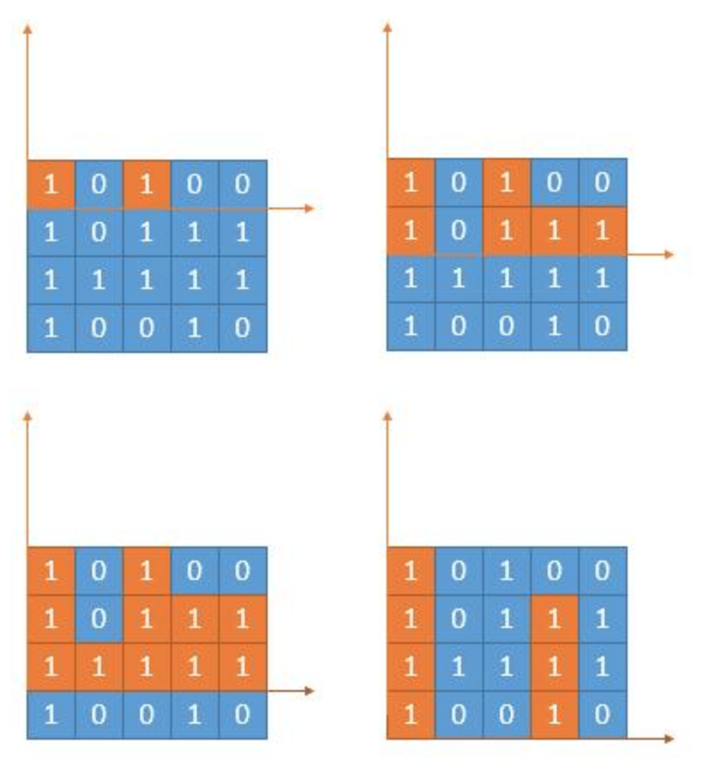

首先可以看下 739.每日温度及496、503下一个更大元素，了解单调栈的妙用。

## [84. 柱状图中最大的矩形](https://leetcode-cn.com/problems/largest-rectangle-in-histogram/)

难度困难

给定 *n* 个非负整数，用来表示柱状图中各个柱子的高度。每个柱子彼此相邻，且宽度为 1 。

求在该柱状图中，能够勾勒出来的矩形的最大面积。


以上是柱状图的示例，其中每个柱子的宽度为 1，给定的高度为 `[2,1,5,6,2,3]`。


图中阴影部分为所能勾勒出的最大矩形面积，其面积为 `10` 个单位。

**示例:**

```
输入: [2,1,5,6,2,3]
输出: 10
```

函数签名：

```go
func largestRectangleArea(heights []int) int
```

## 分析

### 朴素实现

可以枚举所有的宽，对每个宽找到最小对高度求出面积；也可以枚举所有的高（柱子），对每个柱子，向左、向右分别找到不低于当前柱子对柱子，也就确定了宽度，进而可以计算面积。

枚举宽度大体实现：

```go
func largestRectangleArea(heights []int) int {
    res := 0
    for i := 0; i < len(heights); i++ {
        for j := i; j < len(heights); j++ {
            width := j-i+1
            // 找到闭区间 [i, j] 中对最小高度
            height := min(heights[i:j+1])
            res = max(res, width*height)
        }
    }
    return res
}
```

枚举高度大体实现：

```go
func largestRectangleArea(heights []int) int {
    res := 0
    for i, h := range heights {
        width := 0
        for j := i; j >=0 && heights[j] >= h; j-- {
            width++
        }
        for j := i; j < len(heights); j++ {
            width++
        }
        res = max(res, width*h)
    }
    return res
}
```

以上两种解法对时间复杂度是 `O(n)`，空间复杂度是 `O(1)`

## 借助单调栈优化朴素实现

对于第二个朴素实现，可以借助两个单调递增栈，实现以 `O(n)` 的代价确定每个位置 i 向左向右扩展低于 heights[i] 的位置；最终将整个时间复杂度降低到 `O(n)`

```go
func largestRectangleArea(heights []int) int {
    res := 0
    left, right := calLeft(heights), calRight(heights)
    for i, v := range heights {
        res = max(res, v*(right[i]-left[i]-1))
    }
    return res
}

// 计算每个柱子向左延伸，第一个低于当前柱子的柱子位置，可以是 -1
func calLeft(heights []int) []int {
    res := make([]int, len(heights))
    stack := make([]int, 0, len(heights))
    for i, v := range heights {
        for len(stack) > 0 && heights[stack[len(stack)-1]] >= v {
            stack = stack[:len(stack)-1]
        }
        if len(stack) == 0 {
            res[i] = -1
        } else {
            res[i] = stack[len(stack)-1]
        }
        stack = append(stack, i)
    }
    return res
}

// 计算每个柱子向右延伸，第一个低于当前柱子的位置，可以是 len(heights)
func calRight(heights []int) []int {
    res := make([]int, len(heights))
    stack := make([]int, 0, len(heights))
    for i := len(heights)-1; i >= 0; i-- {
        for len(stack) > 0 && heights[stack[len(stack)-1]] >= heights[i] {
            stack = stack[:len(stack)-1]
        }
        if len(stack) == 0 {
            res[i] = len(heights)
        } else {
            res[i] = stack[len(stack)-1]
        }
        stack = append(stack, i)
    }
    return res
}
```

## [85. 最大矩形](https://leetcode-cn.com/problems/maximal-rectangle/)

难度困难

给定一个仅包含 `0` 和 `1` 、大小为 `rows x cols` 的二维二进制矩阵，找出只包含 `1` 的最大矩形，并返回其面积。

**示例 1：**


```
输入：matrix = [["1","0","1","0","0"],["1","0","1","1","1"],["1","1","1","1","1"],["1","0","0","1","0"]]
输出：6
解释：最大矩形如上图所示。
```

**示例 2：**

```
输入：matrix = []
输出：0
```

**示例 3：**

```
输入：matrix = [["0"]]
输出：0
```

**示例 4：**

```
输入：matrix = [["1"]]
输出：1
```

**示例 5：**

```
输入：matrix = [["0","0"]]
输出：0
```

**提示：**

- `rows == matrix.length`
- `cols == matrix[0].length`
- `0 <= row, cols <= 200`
- `matrix[i][j]` 为 `'0'` 或 `'1'`

## 分析

可以枚举所有的矩形，查看是否所有格子都是 1。可以枚举所有的左上角和对应的右下角来确定一个矩形。整个时间复杂度是 `O(n^2 * m^2)`, 其中 n， m 分别是矩阵行数及列数。

实际上这个问题可以划归为上一个问题，以题目中示例一为例：



列方向连续的格子 1 形成了一个个柱子，只需要逐行向下，每次更新 heights，再使用上一题的解法更新结果即可。这样整个时间复杂度降低到了 `O(n*m)`

```go
var left, right, height, stack []int
var res int

func maximalRectangle(matrix [][]byte) int {
    if len(matrix) == 0 || len(matrix[0]) == 0 {
        return 0
    }
    
    reset(len(matrix[0]))
    
    for _, row := range matrix {
        calHeight(row)
        calLeft()
        calRight()
        calRes()
    }
    return res
}

func reset(n int) {
    left = make([]int, n)
    right = make([]int, n)
    height = make([]int, n)
    stack = make([]int, n)
    res = 0
}

func calHeight(row []byte) {
    for i, v := range row {
        if v == '1' {
            height[i]++
        } else {
            height[i] = 0
        }
    }
}

func calLeft() {
    stack = stack[:0]
    for i, v := range height {
        for len(stack) > 0 && height[stack[len(stack)-1]] >= v {
            stack = stack[:len(stack)-1]
        }
        if len(stack) == 0 {
            left[i] = -1
        } else {
            left[i] = stack[len(stack)-1]
        }
        stack = append(stack, i)
    }
}

func calRight() {
    stack = stack[:0]
    for i := len(height)-1; i >= 0; i-- {
        v := height[i]
        for len(stack) > 0 && height[stack[len(stack)-1]] >= v {
            stack = stack[:len(stack)-1]
        }
        if len(stack) == 0 {
            right[i] = len(height)
        } else {
            right[i] = stack[len(stack)-1]
        }
        stack = append(stack, i)
    }
}

func calRes() {
    for i, v := range height {
        tmp := v *(right[i]-left[i]-1)
        if tmp > res {
            res = tmp
        }
    }
}
```
