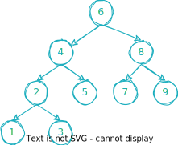

## [剑指 Offer 33. 二叉搜索树的后序遍历序列](https://leetcode.cn/problems/er-cha-sou-suo-shu-de-hou-xu-bian-li-xu-lie-lcof/)

难度中等

输入一个整数数组，判断该数组是不是某二叉搜索树的后序遍历结果。如果是则返回 `true`，否则返回 `false`。假设输入的数组的任意两个数字都互不相同。

参考以下这颗二叉搜索树：

```
     5 
    / \   
   2   6  
  / \ 
 1   3  
```

**示例 1：**

**输入:** [1,6,3,2,5]  
**输出:** false

**示例 2：**

**输入:** [1,3,2,6,5]  
**输出:** true

**提示：**

1. `数组长度 <= 1000`

函数签名：

```go
func verifyPostorder(postorder []int) bool  
```

## 分析

### 分治递归

BST 的后序遍历序列，最后一个元素为根节点的值，其余部分，左边部分是左子树的内容，均小于根；右边部分是其右子树的内容，均大于根。

可以根据这个特点来判定。

```go
func verifyPostorder(postorder []int) bool {
    n := len(postorder)
    if n == 0 {
        return true
    }

    root := postorder[n-1]
    postorder = postorder[:n-1]
    n--
    i := 0
    for i < n && postorder[i] <= root {
        i++
    }
    for _, v := range postorder[i:] {
        if v < root {
            return false
        }
    }
    return verifyPostorder(postorder[:i]) && verifyPostorder(postorder[i:])
}
```

时间复杂度：`O(n^2)`，空间复杂度：`O(n)`。

### 单调栈

看一个例子：



其后续遍历序列 postorder：[1, 3, 2, 5, 4, 7, 9, 8, 6]，没有太明显的特征。

如果这样遍历：根 => 右 => 左，得到的序列 s：[6, 8, 9, 7, 4, 5, 2, 3, 1]，恰好是后续序列的逆序序列。

这个序列就有非常明显的特点了：

1. 如果 s[i] < s[i+1]，则 s[i+1] 一定是 s[i] 的右子节点。
2. 如果 s[i] > s[i+1]，则 s[i+1] 一定是 s[:i+1] 中某个节点的左子节点；那个节点就是 s[:i+1] 中比 s[i+1] 大的节点里最小的那个。

可以使用单调栈辅助。遍历数组的所有元素，如果栈为空，就把当前元素压栈。如果栈不为空，并且当前元素大于栈顶元素，说明是升序的，那么就说明当前元素是栈顶元素的右子节点，就把当前元素压栈，如果一直升序，就一直压栈。当前元素小于栈顶元素，说明是倒序的，说明当前元素是某个节点的左子节点，我们目的是要找到这个左子节点的父节点，就让栈顶元素出栈，直到栈为空或者栈顶元素小于当前值为止，其中最后一个出栈的就是当前元素的父节点。

```go
func verifyPostorder(postorder []int) bool {
	parent := math.MaxInt64
	var stk []int
	for i := len(postorder) - 1; i >= 0; i-- {
        //当前节点小于栈顶元素，说明当前节点是前面某个节点的左子节点，我们要找到他的父节点
		for len(stk) > 0 && stk[len(stk)-1] > postorder[i] {
			parent = stk[len(stk)-1] // 更新父节点
			stk = stk[:len(stk)-1]
		}
        // 作为左子节点，不能比父节点大
        if postorder[i] > parent {
            return false
        }
		
		stk = append(stk, postorder[i])
	}
	return true
}
```

时间复杂度：`O(n)`，空间复杂度：`O(n)`。